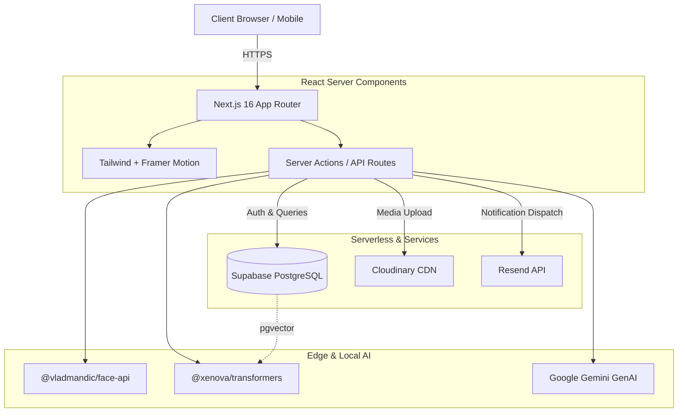

<div align="center">
  <div style="background: linear-gradient(to right, #4f46e5, #ec4899); padding: 2px; border-radius: 16px; display: inline-block;">
    <div style="background: #0f172a; padding: 20px 40px; border-radius: 14px;">
      <h1 align="center" style="margin: 0; color: white;">CrowdCanvas 🎨</h1>
    </div>
  </div>
  <p align="center" style="margin-top: 20px;">
    <strong>The Intelligent, Event-Driven Media Sharing Platform.</strong>
  </p>
  
  <p align="center">
    <a href="https://github.com/Architrb1795/NSS-donation-websitee/actions"></a>
    <a href="https://nextjs.org"></a>
    <a href="https://supabase.com"></a>
    <a href="https://tailwindcss.com"></a>
    <a href="https://github.com/Architrb1795/NSS-donation-websitee/blob/main/LICENSE"></a>
  </p>
</div>

---

## 📖 Project Overview

Event photo sharing is broken. When you attend a wedding, a corporate conference, or a college fest, hundreds of photos are taken, scattered across WhatsApp groups, Google Drives, and AirDrops. Finding the photos *you* are in is a needle-in-a-haystack problem. 

**CrowdCanvas** solves this by combining collaborative event galleries with edge AI. 

It acts as a centralized hub where users can join events, upload full-resolution media, and let AI do the heavy lifting. The platform automatically scans uploaded media to recognize faces (allowing you to instantly "Find Photos of Me"), generates AI descriptions, extracts text via OCR, and provides natural language semantic search.

Built for scale, privacy, and user experience, CrowdCanvas brings enterprise-grade media intelligence to social event sharing.

---

## ✨ Core Features

CrowdCanvas is packed with features designed to handle media intelligently while prioritizing security and user engagement.

### 🎪 Event Management
* **Public & Private Events:** Create open events or private gatherings that require role-based invitations.
* **Role-Based Access Control (RBAC):** Distinct permissions for Owners, Admins, Uploaders, and Viewers.
* **Event Dashboard:** Comprehensive metrics tracking member counts, media volume, and engagement.
* **Pinned Events:** Personalize your discovery feed by pinning your favorite events to the top.

### 🤖 AI Intelligence & Search
* **Semantic Smart Search:** Don't just search for tags; use natural language like "Show me outdoor concert photos" or "Find pictures of people laughing".
* **Automated Tagging & OCR:** Uploaded images are automatically processed by an AI pipeline to extract text (OCR), detect objects, determine mood/scene, and generate descriptive captions.
* **Personalized Recommendation Engine:** The platform analyzes your interactions (views, likes, shares, pins) to curate a personalized feed using vector embeddings and decay-weighted scoring.

### 👤 Face Recognition Pipeline
* **Find Me:** Users can create a secure "Face Profile". The system automatically scans historical and incoming media to find matches.
* **Smart Tagging:** Instead of manually typing names, the system suggests tags based on detected facial embeddings.
* **Privacy-First Approvals:** Users have granular control. By default, being tagged in a photo requires your explicit approval before it is linked to your profile.

### 📱 Social & Engagement
* **Interactive Media Lightbox:** View high-res media with built-in commenting, liking, and sharing capabilities.
* **Favorites System:** Bookmark media to your private collection.
* **Real-time Notifications:** Get instantly notified when someone tags you, comments on your photo, or requests event access.

### 🔒 Security & Watermarking
* **Row-Level Security (RLS):** Supabase RLS guarantees that users can only access media and data they are explicitly authorized to view.
* **Dynamic Watermarking:** Event organizers can enable dynamic watermarks (custom text, opacity, size, and positioning) to protect intellectual property.

---

## 🏗️ Architecture

CrowdCanvas uses a modern, serverless-first architecture optimized for performance and AI capabilities.



* **Frontend Architecture:** Built on **Next.js 16 (App Router)** leveraging React Server Components (RSC) for minimal client bundles. UI is styled with **Tailwind CSS v4** and animated using **Framer Motion**.
* **Backend Architecture:** Server Actions and API Routes handle secure data mutations, bridging the gap between the UI and database without exposing credentials.
* **Database & Storage:** **Supabase (PostgreSQL)** serves as the unified database, utilizing `pgvector` for embedding storage and similarity searches. Raw media is piped directly to **Cloudinary** for optimal CDN delivery and format transformation.
* **AI Architecture:** Face recognition runs via `@vladmandic/face-api`, while semantic search and tagging leverage HuggingFace `@xenova/transformers` and Google Gemini APIs.

> For a deep dive into the system design, see [docs/architecture.md](./docs/architecture.md).

---

## 🛠️ Tech Stack

### Frontend
* **Framework:** Next.js 16.2.6 (App Router, React 19)
* **Styling:** Tailwind CSS v4, `clsx`, `tailwind-merge`
* **Animations:** Framer Motion
* **Icons:** Lucide React
* **Data Visualization:** Recharts

### Backend & Database
* **Database:** Supabase (PostgreSQL 15+)
* **Vector Engine:** `pgvector` extension
* **Authentication:** Supabase Auth (Email, OAuth)
* **Storage:** Cloudinary (via `next-cloudinary`)

### AI & Machine Learning
* **Facial Recognition:** `@vladmandic/face-api`
* **Local Embeddings:** `@xenova/transformers`
* **OCR:** `tesseract.js`
* **Generative AI:** Google Gemini SDK (`@google/genai`)

---

## 📁 Project Structure

```text
CrowdCanvas/
├── app/                  # Next.js App Router (Pages, Layouts, API Routes)
│   ├── (auth)/           # Authentication routes (Login, Register, Password)
│   ├── (dashboard)/      # Protected routes (Events, AI Search, Profile)
│   └── api/              # Backend API Endpoints & Webhooks
├── components/           # Reusable UI Components
│   ├── ai/               # Recommendation Engine & Dashboard UI
│   ├── events/           # Event Creation, Gallery, and Analytics
│   ├── faces/            # Facial Recognition Enrollment UI
│   ├── media/            # Media Upload, Lightbox, Grid, Watermarking
│   └── shared/           # Navbar, Buttons, Layout Wrappers
├── lib/                  # Core Business Logic & Services
│   ├── actions/          # Next.js Server Actions (Database mutations)
│   ├── ai/               # Embeddings, Tagging, and Search logic
│   ├── faces/            # Face detection and matching services
│   ├── recommendation/   # Weighted algorithm scoring logic
│   └── supabase/         # Client & Server DB initialization
├── supabase/             # Database Migrations & Unified Schema
├── docs/                 # Extended Technical Documentation
└── public/               # Static assets
```

---

## 🔐 Database & Authentication

### Unified Schema & RLS
The database utilizes a highly normalized PostgreSQL schema protected entirely by **Row Level Security (RLS)**. No direct table access is permitted without an authenticated session context. 

Key tables include:
* `profiles` & `user_sessions`: Identity and tracking.
* `events` & `event_members`: Core RBAC and event metadata.
* `media` & `media_faces`: Content and extracted AI vectors.
* `user_preference_profiles`: Machine learning feedback loops.

> Read the full database spec in [docs/database.md](./docs/database.md) and security models in [docs/security.md](./docs/security.md).

### Authentication
Handled via Supabase Auth. It supports magic links, secure session cookies (via Next.js Middleware), and OAuth integrations.

---

## 🚀 Setup Guide

### 1. Clone the Repository
```bash
git clone https://github.com/Architrb1795/CrowdCanvas.git
cd CrowdCanvas
```

### 2. Install Dependencies
```bash
npm install
```

### 3. Environment Variables
Copy `.env.example` to `.env.local` and fill in your keys:
```env
NEXT_PUBLIC_SUPABASE_URL=your_supabase_url
NEXT_PUBLIC_SUPABASE_ANON_KEY=your_supabase_anon_key
SUPABASE_SERVICE_ROLE_KEY=your_supabase_service_role
NEXT_PUBLIC_CLOUDINARY_CLOUD_NAME=your_cloud_name
CLOUDINARY_API_KEY=your_api_key
CLOUDINARY_API_SECRET=your_api_secret
GEMINI_API_KEY=your_gemini_key
```

### 4. Database Setup
Execute the unified schema script located in `supabase/schema.sql` via your Supabase SQL Editor to provision all tables, vectors, triggers, and RLS policies.

### 5. Run Development Server
```bash
npm run dev
```
Navigate to `http://localhost:3000`.

---

## 🚢 Deployment

CrowdCanvas is optimized for deployment on Vercel. 
For production deployment checklists, caching strategies, and environment setup, please refer to [docs/deployment.md](./docs/deployment.md).

---

## 🗺️ Roadmap

**Completed:**
- [x] Next.js 16 App Router foundation
- [x] Supabase Auth & RLS integration
- [x] Cloudinary Media Pipeline
- [x] AI Semantic Search (`pgvector`)
- [x] Facial Recognition & Tagging

**In Progress:**
- [ ] Real-time Socket.io Notification fallback
- [ ] Advanced Admin Analytics Dashboard

**Planned:**
- [ ] Mobile-native wrapper (React Native / Capacitor)
- [ ] End-to-end encryption for private event media

---

## 🤝 Contributing

We welcome contributions! Please review our [Contribution Guidelines](CONTRIBUTING.md) and read through the `docs/` folder to understand the architecture before submitting a Pull Request.

1. Fork the Project
2. Create your Feature Branch (`git checkout -b feature/AmazingFeature`)
3. Commit your Changes (`git commit -m 'Add some AmazingFeature'`)
4. Push to the Branch (`git push origin feature/AmazingFeature`)
5. Open a Pull Request

---

## 📄 License

Distributed under the MIT License. See `LICENSE` for more information.

---
*Built by [Archit](https://github.com/Architrb1795) & Team.*
